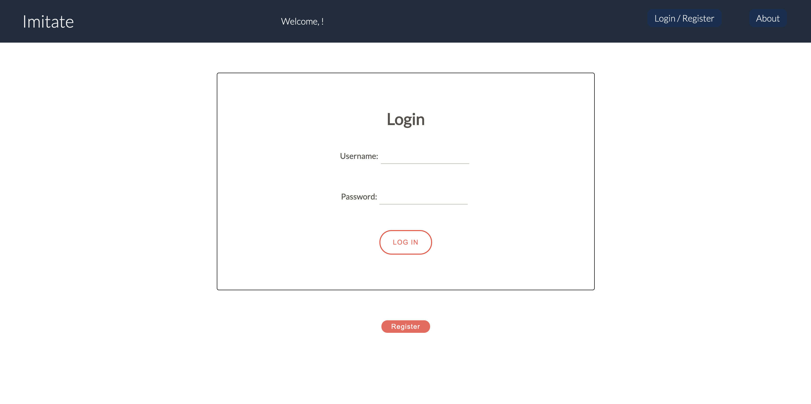
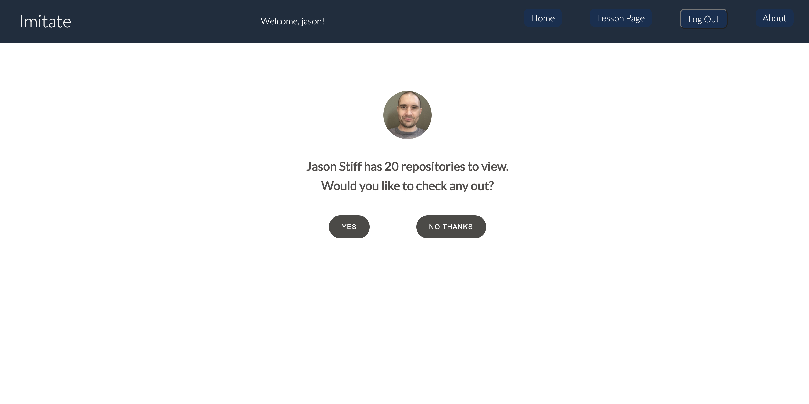
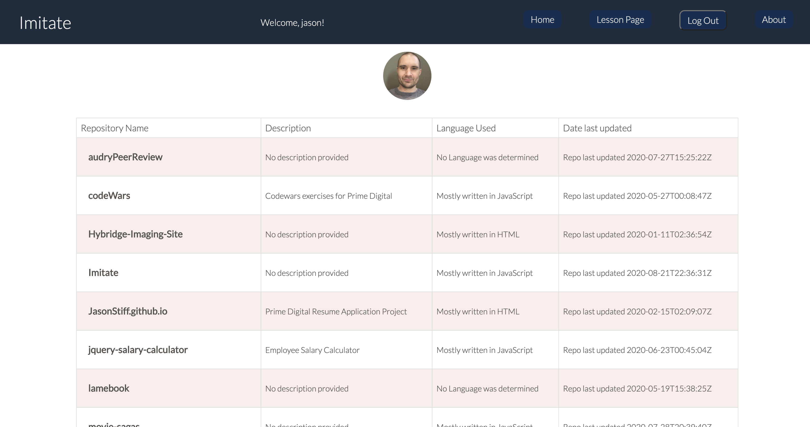
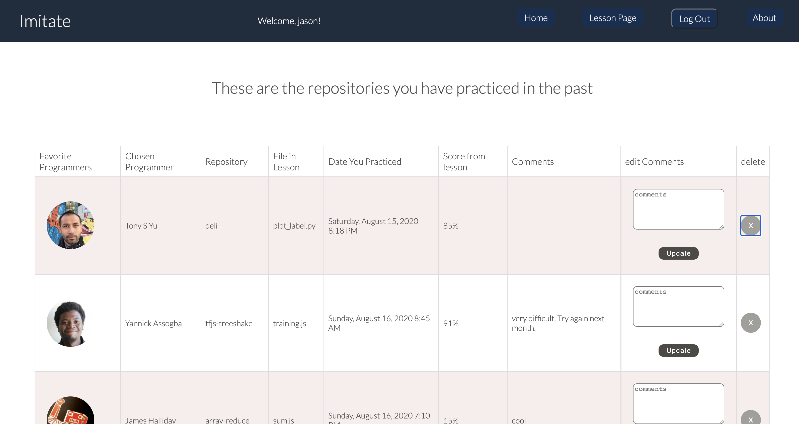

# Imitate

Application that allows users to study their favorite programers code and practice typing over that code. Uses the GitHub Api to pull in your favorite code and displays it to your screen. It's a great way to learn how more advanced programmers write code while at the same time improving your own typing skills.

This application uses the GitHub API, React, Redux, Express, Passport, and PostgreSQL (a full list of dependencies can be found in `package.json`).

### Login page



### Search GitHub by providing any GitHub users username into the input field.


### Prompt shows the searched users Avatar. Provides a choice to continue on to search or return back and search for another programmer .



### Table listing Users Repos that can be searched.



### Lesson page that allows you to practice your typing skills over your favorite Programmers GitHub code.


### History page lists out all of your lessons with scores and comment sections.



### If you clone this Repository.

Make sure you have the following software installed on your computer:

- [Node.js](https://nodejs.org/en/)
- [PostrgeSQL](https://www.postgresql.org/)
- [Nodemon](https://nodemon.io/)

## Create database and table

Create a new database called `prime_app` and use the database.sql file to populate your tables:

```SQL
CREATE TABLE "user" (
    "id" SERIAL PRIMARY KEY,
    "username" VARCHAR (80) UNIQUE NOT NULL,
    "password" VARCHAR (1000) NOT NULL,
    "first_name" VARCHAR (80),
    "email" VARCHAR (320)
);
CREATE TABLE "metrics"(
	"id" SERIAL PRIMARY KEY,
	"percent_correct" INT NOT NULL,
	"time_stamp" VARCHAR(128),
	"user_id" integer REFERENCES "user",
	"file_id" integer REFERENCES "chosen_file"
);
CREATE TABLE "fav_coders"(
	"id" SERIAL PRIMARY KEY,
	"name" VARCHAR(80),
	"user_name" VARCHAR(80),
	"avatar_url" VARCHAR(1200)

);
CREATE TABLE "repos"(
	"id" SERIAL PRIMARY KEY,
	"repo_name" VARCHAR(120),
	"repo_url" VARCHAR(1200),
	"repo_owner" integers REFERENCES "fav_coders"

);
CREATE TABLE "chosen_file"(
	"id" SERIAL PRIMARY KEY,
	"file_name" VARCHAR(120),
	"file_url" VARCHAR(1200),
	"repo_id" integer REFERENCES "repos"
);
CREATE TABLE "user_favCoder"(
	"id" SERIAL PRIMARY KEY,
	"user_id" integer REFERENCES "user",
	"fav_coder_id" integer REFERENCES "fav_coders"

);

```

If you would like to name your database something else, you will need to change `prime_app` to the name of your new database name in `server/modules/pool.js`

## Development Setup Instructions

- Run `npm install`
- Start postgres if not running already by using `brew services start postgresql`
- Run `npm run server`
- Run `npm run client`
- Navigate to `localhost:3000`
