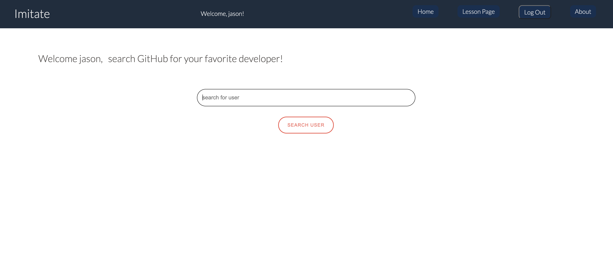
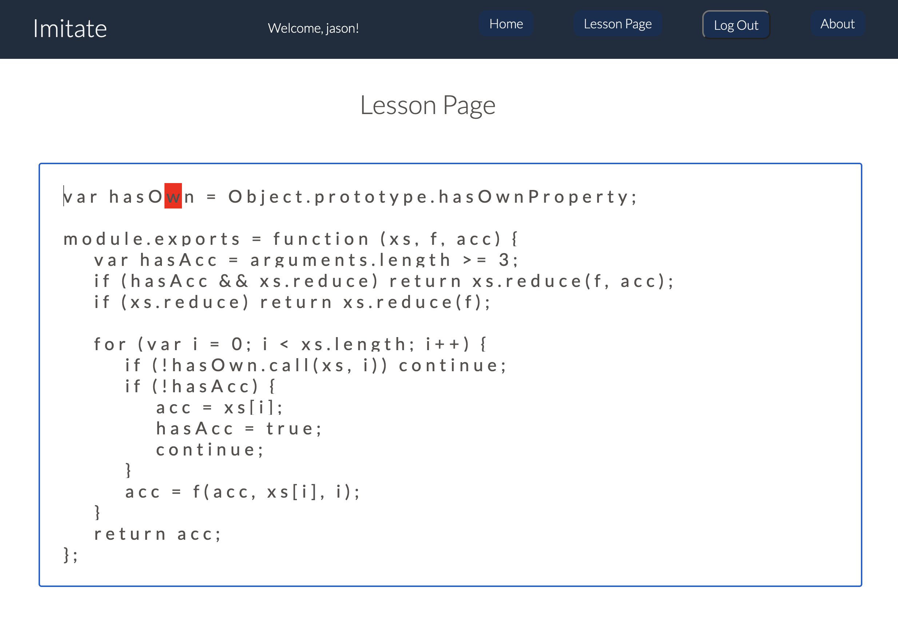

# Imitate

Application that allows users to study their favorite programers code and practice typing over that code. Uses the GitHub Api to pull in your favorite code and displays it to your screen. It's a great way to learn how more advanced programmers write code while at the same time improving your own typing skills.

This application uses the GitHub API, React, Redux, Express, Passport, and PostgreSQL (a full list of dependencies can be found in `package.json`).

## lesson page once user chooses a repository to practice typing over.

## If you clone this Repository.

Make sure you have the following software installed on your computer:

- [Node.js](https://nodejs.org/en/)
- [PostrgeSQL](https://www.postgresql.org/)
- [Nodemon](https://nodemon.io/)

## Create database and table

Create a new database called `prime_app` and use the database.sql file to populate your tables:

If you would like to name your database something else, you will need to change `prime_app` to the name of your new database name in `server/modules/pool.js`

## Development Setup Instructions

- Run `npm install`
- Start postgres if not running already by using `brew services start postgresql`
- Run `npm run server`
- Run `npm run client`
- Navigate to `localhost:3000`

1. Start the server - `npm run server`
